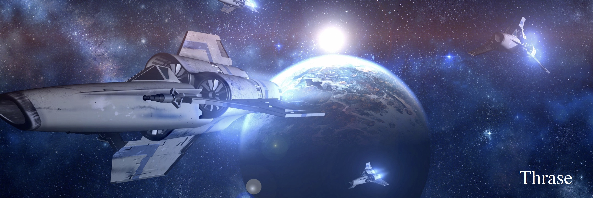

# Thrase

# About

Thrase is a GPU-enabled, high-order accurate SBP-SAT finite difference code on unstructured meshes for SEAS (Sequences of Earthquakes and Aseismic Slip) problems written entirely in Julia.  

# Features:
- high-order accurate finite difference spatial discretizations featuring provably stability
- direct and matrix-free iterative solvers for static problems via Julia
- non-stiff methods for fully-dynamic (wave propagation) problems involving rate-and-state friction
- high-order accurate, adaptive time-stepping via Julia
- unstructured hexahedral meshes
- non-planar boundaries and interfaces 

# Dependencies: 
- Thrase is written entirely in <a href="https://julialang.org">Julia</a>

# Installation: 
- Download <a href="https://julialang.org">Julia</a>
- Coming soon: add the Thrase package: from the julia repl, type ]add Thrase
- Test the installation: from the julia repl, type ]test Thrase

# Getting Started:
- Coming soon!

# Documentation: 
<a href="https://thrase.github.io/Thrase.jl/dev/"> More to come soon...

# How to cite: 
- Erickson, B. A., Kozdon, J. E., and Harvey, T. (2022), <a href="https://link.springer.com/article/10.1007/s10915-022-01961-1">A non-stiff summation-by-parts finite difference method for the wave equation in second order form: Characteristic boundary conditions and nonlinear interfaces</a>, Journal of Scientific Computing, doi: 10.1007/s10915-022-01961-1. 
- Kozdon, J. E., Erickson, B. A., and Wilcox, L. C. (2020), <a href="https://link.springer.com/article/10.1007/s10915-021-01448-5">Hybridized summation-by-parts finite difference methods</a>, Journal of Scientific Computing, doi: 10.1007/s10915-021-01448-5.
- Erickson, B. A. and Dunham, E. M. (2014), <a href="https://ix.cs.uoregon.edu/~bae/resources/Erickson_Dunham_jgrb50593.pdf">
  An efficient numerical method for earthquake cycles in heterogeneous media: Alternating sub-basin and surface-rupturing events on faults crossing a sedimentary basin</a>, Journal of  Geophysical Research, doi:10.1002/2013JB010614.

# License: 
- Distributed under the MIT License. See LICENSE.txt for more information.

# Contact:
- Brittany A. Erickson (bae@uoregon.edu)

