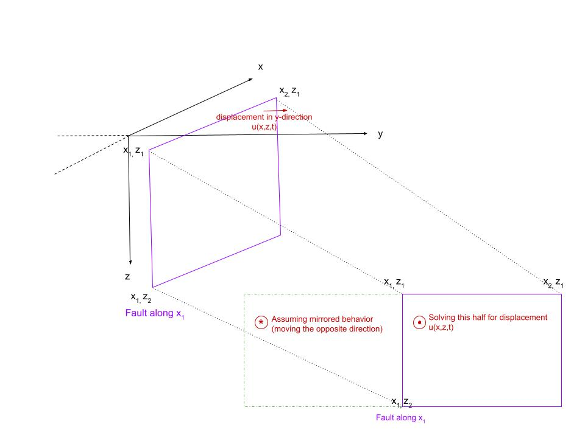
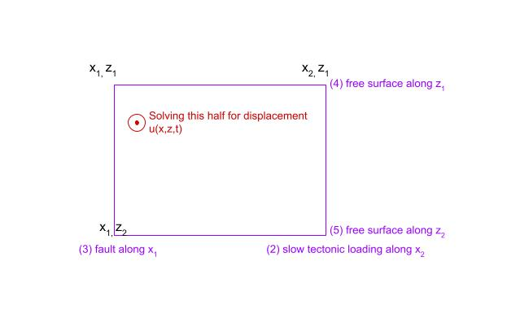

# Numerical Methods
This page describes how we solve the benchmark problem 1 (BP1-QD) using numerical methods.

## Computational Domain
The first consideration to make is that we must convert the semi-infinite domain problem from the original description into a finite problem that we can compute.

First, we assume a fixed y value, which is the plane in which displacement happens. 
This means that our fields depend only on the x and z values, creating a two dimensional problem.

We restrict the x-axis of the computational domain in the following ways:
* x<sub>1</sub> - x<sub>2</sub> becomes one side of the problem, where we assume mirrored behavior on the other half
* x<sub>1</sub> can thus always be 0
* x<sub>2</sub> can be any value, a good default is 100 (km)
* the fault is located along x<sub>1</sub>

We then restrict the z-axis of the computational domain as such:
* z<sub>1</sub>=0 can be assumed as the location where the ground meets the air 
* z<sub>2</sub> can be any depth value, a good default is 100 (km)
* The external forces along z<sub>1</sub> equal 0 because it is a "free surface" where external forces can be assumed to have no effect
* The external forces along z<sub>2</sub> also equal 0 because it is far enough down to also be considered a "free surface"



## Governing Equations
We now discuss the governing equations for our problem setup. 

(1) We are solving a 2D poisson equation given by:
```math
0= \mu(\frac{\partial^2u}{\partial^2x}+\frac{\partial^2u}{\partial^2z})
```

(2) We consider the material displacement over time as u(x,z,t). The slow tectonic loading (input parameter plate rate = V<sub>p</sub>) at the far right boundary (x<sub>2</sub>) is given by:
```math
u(x=x_2, z, t) = \frac{V_pt}{2}
```

(3) The material displacement at the far left boundary (x<sub>1</sub>) is given by:
```math
u(x=x_1, z, t) = \delta(z,t)
```

(4) The "free surface" at z<sub>1</sub> is given by:
```math
\mu\frac{\partial u}{\partial z}(x, z = z_1, t) = 0
```

(5) Likewise, the "free surface" at z<sub>2</sub> is given by:
```math
\mu\frac{\partial u}{\partial z}(x, z = z_2, t) = 0
```


## Converting $\theta$ into $\psi$
In the benchmark description we denote the state variable as $\theta$, but for computation we prefer to use the equivalent (mathematically consistent) $\psi$ as the state variable. We do this because it limits the range over a smaller order of magnitude. We describe how we convert from $\theta$ into $\psi$ for computing this problem.

From equation (7) in the benchmark description, we define $\psi$ as the numerator of the exponent fraction, so: 

```math
\psi = f_0 + b \ln(\frac{V_0\theta}{D_c})
```
Substituting this into our aging law for $\theta$ (equation 6 in the benchmark description) we get the following aging law for $\psi$:
```math
\frac{d\psi}{dt} = \frac{bV_0}{D_c} [e^{\frac{f_0-\psi}{b}}-\frac{V}{V_0}]
```

## Frictional Fault Boundary Condition Details
Now, using $\psi$ instead of $\theta$ we can define the frictional strength at the fault (x = x<sub>1</sub>) from equation 5 in the benchmark as:

```math
\tau = F(V,\psi)
```
where $\tau$ is the fault shear stress...and $F(V,\psi)$ is the frictional strength:

```math
F(V,\psi) = \sigma_n a \sinh^{-1}[\frac{V}{2V_0}e^{\psi/a}]
```

## Numerical Time-Stepping Method
We formulate the governing equations as an Index-1 differential algebraic equation (DAE) where slip and state evolve in time and a non-linear equation for slip rate must be solved at each timestep.

We illustrate our timestepping method using Forward Euler (from t<sup>n</sup> -> t<sup>n+1</sup> in one step). However, please note that in the code we use the TSit5() function which actually utilizes a Runge-Kutta method. The Runge-Kutta method employs the same steps as Forward Euler but calculates intermediate values between t<sup>n</sup> and t<sup>n+1</sup> to arrive at a more accurate solution for t<sup>n+1</sup>, thus it is more computationally intense. 

Assuming we know everything at time t<sup>n</sup> we take the following steps to calculate values at t<sup>n+1</sup>:

(1) Integrate $\delta$ and $\psi$, 
```math
\delta^{n+1} = \delta^n + dt V^n 
```
```math
\psi^{n+1} = \psi^n + dt G(V^n, \psi^n)
```
(2) Solve the poisson equation using the Summation-By-Parts Simultaneous Approximation Term (SBP-SAT) finite difference method.
This means that we solve the linear system Au<sup>n+1</sup> = b<sup>n+1</sup> for u<sup>n+1</sup>. Where u<sup>n+1</sup> is equal to the displacement everywhere. In this step we obtain the answer for u(x,z,t<sup>n+1</sup>) by solving:

```math
0= \mu(\frac{\partial^2u}{\partial^2x}+\frac{\partial^2u}{\partial^2z})
```
with the following boundary conditions for t<sup>n+1</sup>:
```math
u(x=x_2, z, t^{n+1}) = \frac{V_pt^{n+1}}{2}
```
```math
u(x=x_1, z, t^{n+1}) = \frac{\delta^{n+1}}{2}
```
```math
\mu\frac{\partial u}{\partial z}(x, z = z_1, t^{n+1}) = 0
```
```math
\mu\frac{\partial u}{\partial z}(x, z = z_2, t^{n+1}) = 0
```

(3) Compute $\tau^{n+1}$, since:
```math
\tau^{n+1} = \tau_0 + \left.\mu\frac{\partial u^{n+1}}{\partial x}\right\vert_{x=x_1} - \eta V 
```

(4) Solve for the new slip rate V<sup>n+1</sup> by imposing friciton (F). Our nonlinear equation is given by the following where everything is known except for V<sup>n+1</sup>, we solve using Newton's method:
```math
\tau^{n+1} = F(V^{n+1}, \psi^{n+1}) 
```
We see in the code that we solve this way for the new values of slip and state for the z grid points where the rate-and-state fault is applicable (to depth W<sub>f</sub>). For the values below that in the z-direction we simply apply the constant slip rate.

(5) Return to step 1 for timestep t<sup>n+2</sup>


