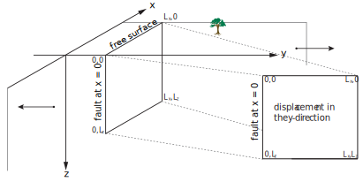
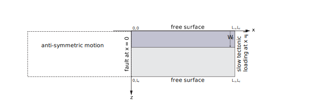

# Numerical Methods
This page describes how we solve the benchmark problem 1 (BP1-QD).

## Computational Domain
The first consideration to make is that we must convert the semi-infinite domain problem from the original description into a finite domain problem to which we can apply finite difference methods.

The anti-plane assumption means that fields depend only on the x and z values, creating a two dimensional problem.

We restrict our domain to $(x, z)$ in $(0, L_x)$ x $(0, L_z)$, with the fault at x = 0, and assume anti-symmetry for x in $(-L_x, 0)$. 

$z = 0$ refers to Earth's free surface, and at $z = L_z$ we also assume a traction-free boundary. 



## Governing Equations
As described in the benchmark description, the governing equations are

(1) the 2D poisson equation given by:
```math
0= \mu(\frac{\partial^2u}{\partial x^2}+\frac{\partial^2u}{\partial z^2}).
```

(2) The material displacement is given by u(x,z,t). Slow tectonic loading (input parameter plate rate = $V_p$) is imposed at the far right boundary ($x_2$) is given by:
```math
u(x=x_2, z, t) = \frac{V_pt}{2}
```

(3) The material displacement at the fault is given by:
```math
u(x=x_1, z, t) = \delta(z,t)
```
where $\delta(z, t)$ is the fault slip.

(4) The free surface at z = 0 is given by:
```math
\mu\frac{\partial u}{\partial z}(x, z = 0, t) = 0
```

(5) Likewise, the free surface at z<sub>2</sub> is given by:
```math
\mu\frac{\partial u}{\partial z}(x, z = L_z, t) = 0
```



## Converting $\theta$ into $\psi$
In the benchmark description the state variable is given in terms of $\theta$, but we prefer to use the equivalent (mathematically consistent) $\psi$ as the state variable, defined by

```math
\psi = f_0 + b \ln(\frac{V_0\theta}{D_c})
```
This defines the following aging law for $\psi$:
```math
\frac{d\psi}{dt} = G(V, \psi)
```
where
```math
G(V, \psi) = \frac{bV_0}{D_c} [e^{\frac{f_0-\psi}{b}}-\frac{V}{V_0}]
```

## Frictional Fault Boundary Condition Details
Now, using $\psi$ instead of $\theta$ we can define the frictional strength at the fault (x = 0) from equation 5 in the benchmark as:

```math
\tau = F(V,\psi)
```
where $\tau$ is the fault shear stress...and $F(V,\psi)$ is the frictional strength:

```math
F(V,\psi) = \sigma_n a \sinh^{-1}[\frac{V}{2V_0}e^{\psi/a}]
```

## Numerical Time-Stepping Method
We formulate the governing equations as an Index-1 differential algebraic equation (DAE) where slip and state evolve in time and a nonlinear equation for slip rate must be solved at each timestep.

We illustrate our timestepping method using Forward Euler (from $t^n$ -> $t^{n+1}$ in one step). However, please note that in the code we use Julia's TSit5() function (a 4/5-order adaptive Runge-Kutta method). 

Assuming we know all fields at time $t^n$ we take the following steps to calculate values at $t^{n+1}$:

(1) Integrate $\delta$ and $\psi$, 
```math
\delta^{n+1} = \delta^n + dt V^n 
```
```math
\psi^{n+1} = \psi^n + dt G(V^n, \psi^n)
```
(2) Solve the poisson equation using the Summation-By-Parts Simultaneous Approximation Term (SBP-SAT) finite difference method.
This amounts to solving the linear system $Au^{n+1} = b^{n+1}$ for $u^{n+1}$. Where $u^{n+1}$ is the displacement within the entire domain at time $t^{n+1}$. In this step we assume the following boundary conditions at $t^{n+1}$:
```math
u(x=L_x, z, t^{n+1}) = \frac{V_pt^{n+1}}{2}
```
```math
u(x=0, z, t^{n+1}) = \frac{\delta^{n+1}}{2}
```
```math
\mu\frac{\partial u}{\partial z}(x, z = 0, t^{n+1}) = 0
```
```math
\mu\frac{\partial u}{\partial z}(x, z = L_z, t^{n+1}) = 0
```

(3) In the rate-and-state portion of the fault we next compute the change in shear stress due to quasi-static deformation $\Delta \tau^{n+1}$ via:
```math
\Delta\tau^{n+1} = \left.\mu\frac{\partial u^{n+1}}{\partial x}\right\vert_{x=0}
```

(4) and then solve for the new slip rate $V^{n+1}$ by imposing friction. This yields a nonlinear equation (where everything is known except for $V^{n+1}$):
```math
\tau_0 + \Delta\tau^{n+1} - \eta V^{n+1} = F(V^{n+1}, \psi^{n+1}) 
```
which is solved usign a bracketed Newton method (i.e. safe-guarded with bisection). 

For fault depths below the rate-and-state region, $V^{n+1}$ is set to the plate rate $V_p$ as specified in the benchmark. 

(5) Return to step 1 for timestep $t^{n+1}$


